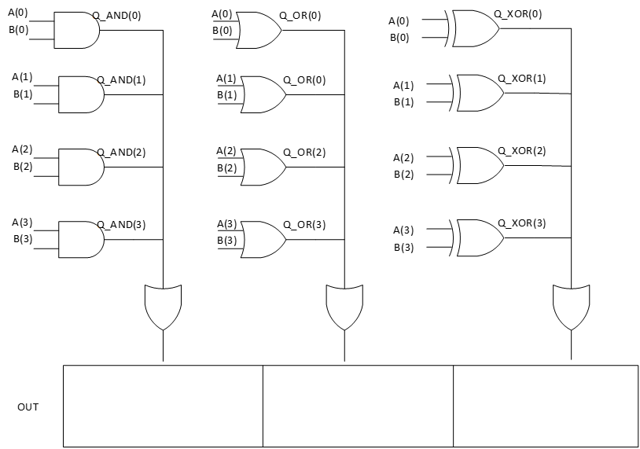

# 🔹 Project 3 — Logic Vector Operations

## 📘 Description
This project demonstrates bitwise logical operations on **multi-bit vectors** in VHDL.  
The design applies logical functions (AND, OR, XOR) across corresponding bits of input vectors and maps the results to FPGA LEDs.

---

## ⚙️ Inputs & Outputs

**Inputs**
- `A` — input logic vector  
- `B` — input logic vector  

**Outputs**
- `Q(0)` — bitwise AND result  
- `Q(1)` — bitwise OR result  
- `Q(2)` — bitwise XOR result  

---

## 🧩 Architecture Diagram

<table align="center" bgcolor="#eef3fb">
  <tr>
    <td align="center">
      
    </td>
  </tr>
</table>

---

## 🔌 Pin Mapping
All FPGA pin assignments are defined in the `.ucf` constraint file included in this project.

---

## 📂 Files
- `logic_vector_operations.vhd` — Main VHDL source  
- `logic_vector_operations.ucf` — Pin constraints  
- `logic_vector_operations.xise` — ISE project file  
- `diagram.png` — Architecture diagram  

---

## 🧠 Concepts Demonstrated
- Vector signals in VHDL  
- Bitwise logical operators  
- Multi-bit combinational logic  
- Direct mapping of logic results to physical FPGA outputs
